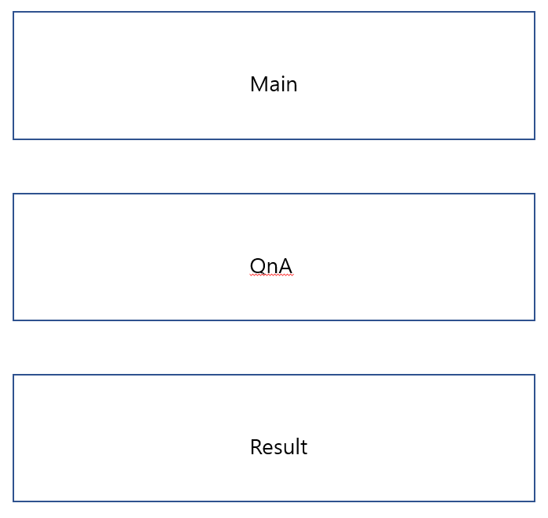
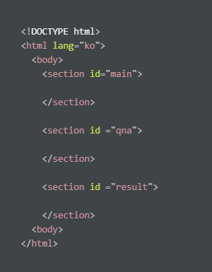

# Page Layout (기본구성)
 

1) display none block을 적절히 활용해서 페이지 보여주기
2) BootStrap 활용 반응형 페이지
https://getbootstrap.com/docs/5.1/components/buttons/
3) animation 효과 
http://tcpschool.com/css/css3_transform_animation
4) color 색깔 
5) colorzilla.com
